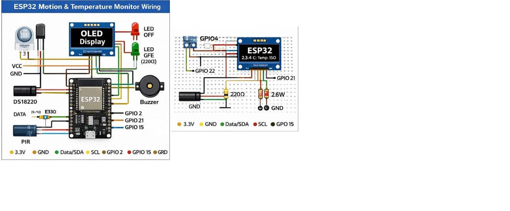

# ESP32-Motion-Temperature-Monitor
A real-time embedded monitoring system using ESP32 that detects motion, measures ambient temperature, and provides visual and audible alerts via OLED, LED, and buzzer.

# ESP32 Motion & Temperature Monitoring System

## 📌 Overview
This project implements a real-time monitoring system using an ESP32 microcontroller.  
It continuously monitors *motion* and *ambient temperature, providing immediate **visual and audible alerts*.

## 🔧 Features
- PIR-based motion detection
- Temperature monitoring using DS18B20
- Real-time OLED dashboard
- LED status indicator
- Continuous buzzer alert on motion detection

## 🧰 Hardware Components
- ESP32 (30-pin)
- PIR Motion Sensor (HC-SR501)
- DS18B20 Temperature Sensor
- OLED SSD1306 (I2C)
- Active Buzzer
- LED + 220Ω resistor
- Breadboard & jumper wires

## 🔌 Pin Configuration
| Component | ESP32 Pin |
|--------|-----------|
| PIR OUT | GPIO4 |
| DS18B20 | GPIO18 |
| LED | GPIO2 |
| Buzzer | GPIO15 |
| OLED SDA | GPIO21 |
| OLED SCL | GPIO22 |

## 🖥 System Behavior
- *Idle State:*  
  OLED displays temperature, motion status = IDLE  
- *Motion Detected:*  
  - LED turns ON  
  - Buzzer emits continuous alert  
  - OLED updates status in real time  

## 📐 Circuit Diagram

## 🔄 State Diagram

## 🎥 Demo Video

## 🧠 Skills Demonstrated
- Embedded C/C++ programming
- Multi-sensor integration
- Real-time system design
- PWM signal control
- OLED data visualization
- Modular and scalable firmware architecture

## 👤 Author
*Milad Mohseni*
